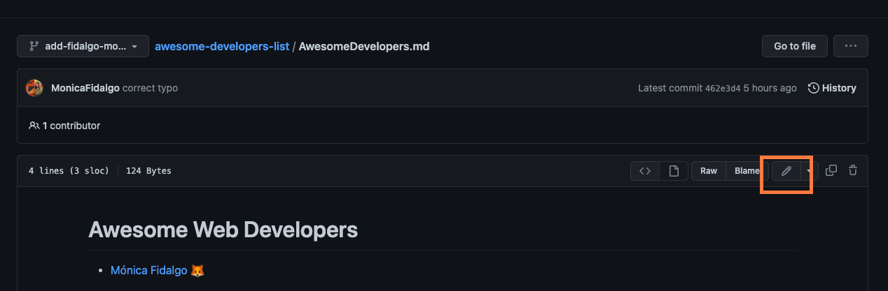

[](https://opensource.org/licenses/MIT)

<h2 align="center">
  Awesome Developers List 🚀
</h2>
<div align="center">
  
</div>


## About this Project

This project is super simple and begginer friendly to allow everyone to start to contribute to an open source project.

For this tutorial you can either do it directly on GitHub or you can use the Command Line.

#### If you don't have git on your machine, you can [install it](https://help.github.com/articles/set-up-git/).

#### If you prefer to do it on GitHub, check [Introduction to GitHub](https://github.com/skills/introduction-to-github)
<br />

## Steps:
<br />

## ✨ Step 1: Fork this repository 🍴


Fork this repository by clicking on the <strong>fork</strong> button on the top of this page.


This will create a copy of this repository in your <strong>account</strong>.

<br />

## ✨ Step 2: Clone the repository 👯

Git clone allows you to copying the contents of the awesome-developers-list repository on GitHub <strong>to your computer</strong>.

<strong>❕Note</strong>: If you are not using the command line, go to step 3

### 🤖 With command line:

Now <strong>clone</strong> the forked repository to your machine. Go to your GitHub account, open the forked repository, click on the code button and then click the _copy to clipboard_ icon.


Open a terminal and run the following git command:

```
git clone "url you just copied"
```

Where "url you just copied" (without the quotation marks) is the url to this repository (your fork of this project). See the previous steps to obtain the url.


For example:

```
git clone https://github.com/<your_github_username_here>/awesome-developers-list
```

Don't forget to change  `<your_github_username_here>` to your GitHub username.


<br />


## ✨ Step 3: Create a branch 🌳

### 🤖 With command line:

Change to the repository directory on your computer:

```
cd awesome-developers-list
```

Now create a branch using the `git checkout` command:

```
git checkout -b your-new-branch-name
```

For example:

```
git checkout -b adding-ada-lovelace
```

(You can start the name of the branch with _adding_ , to be more consistent)


### 🐱 Without command line:

Alternatively, you can also create a branch directly on your GitHub repository


<br />

## ✨ Step 4: Add your name and link and commit your changes 📝

### 🤖 With command line:

Now open `AwesomeDevelopers.md` file in a text editor and at the end of the file, add your name, role (if you prefer) and a link to your website, github, etc

Example:

```
[Mónica Fidalgo - Vue|React Developer](https://github.com/MonicaFidalgo/)
```

To check if your changes are being tracked you can type `git status`, and you'll see if there are any changes.

If so, add those changes to the branch you just created using the `git add` command:

```
git add AwesomeDevelopers.md
```

Now commit those changes using the `git commit` command:

```
git commit -m "Add <your-name> to Developers list"
```

replacing `<your-name>` with your name.


### 🐱 Without command line:

Alternatively, you can edit the file on GitHub itself



And then commit the changes

<br />


## ✨ Step 5: Push changes to GitHub 🚀 

The git push command is used to upload local repository content to a remote repository.

<strong>❕Note</strong>: If you are not using the command line, go to step 6

### 🤖 With command line:

Push your computer local changes using the command `git push`:

```
git push origin <add-your-branch-name>
```

replacing `<add-your-branch-name>` with the name of the branch you created earlier.

<br />

## ✨ Step 6: Finally, submit your changes for review 👀 

Go now to the main repository on gitHub, you should be able to see something similar


Now you can create a pr, by adding a description and then submit the pull request. You can also check the changes that you did on the bottom, the before and the after


After that, I will check your pr and merge it to the main branch!


### 🎉🎉🎉


## Congrats! You made your first contribution to an open source project🥳🥳

If you liked this step to step, fell free to follow me on GitHub, I have already more ideas that you can contribute as well❤️
