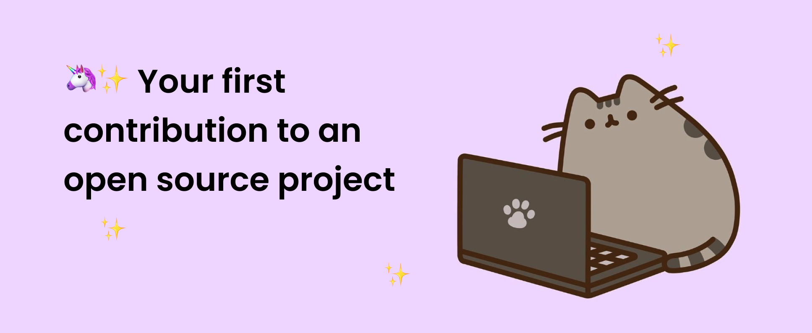
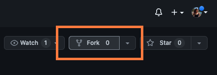
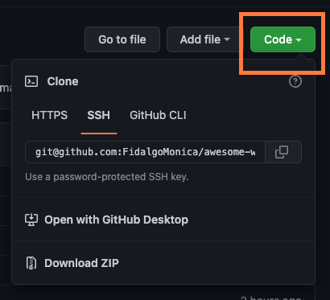
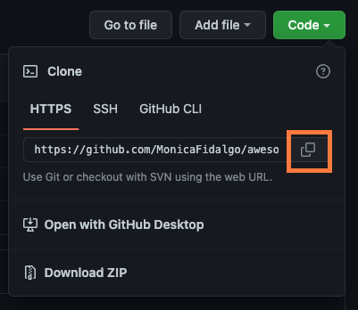
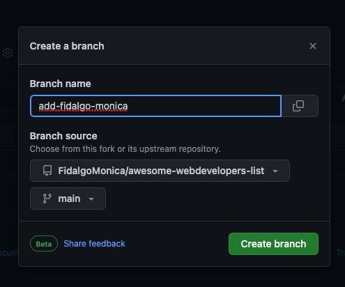
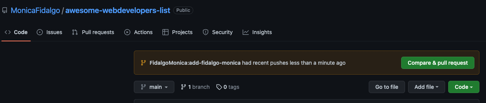
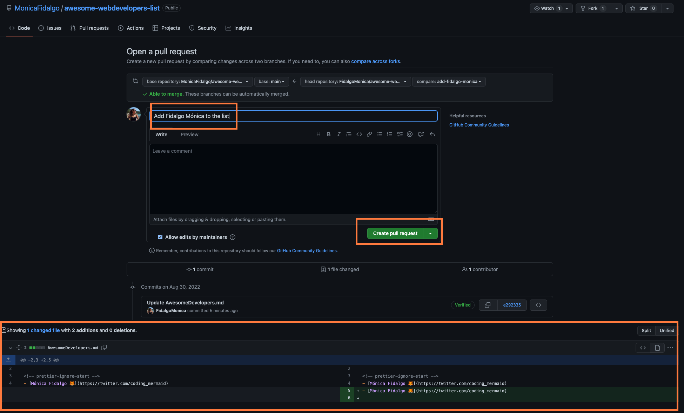

[](https://opensource.org/licenses/MIT)

<h2 align="center">
  Awesome Developers List 🚀
</h2>
<div align="center">
  
</div>


## About this Project

This project is super simple and begginer friendly to allow everyone to start to contribute to an open source project.

For this tutorial you can either use GitHub Desktop or the Command Line.

#### If you don't have git on your machine, you can [install it](https://help.github.com/articles/set-up-git/).

## Steps:

## 1. Fork this repository 🍴


Fork this repository by clicking on the <strong>fork</strong> button on the top of this page.



This will create a copy of this repository in your <strong>account</strong>.


## 2. Clone the repository 👯


Now <strong>clone</strong> the forked repository to your machine. Go to your GitHub account, open the forked repository, click on the code button and then click the _copy to clipboard_ icon.





Open a terminal and run the following git command:

```
git clone "url you just copied"
```

where "url you just copied" (without the quotation marks) is the url to this repository (your fork of this project). See the previous steps to obtain the url.


For example:

```
git clone https://github.com/<your_github_username_here>/awesome-developers-list
```

Don't forget to change  `<your_github_username_here>` to your GitHub username.

Git clone allows you to copying the contents of the awesome-developers-list repository on GitHub <strong>to your computer</strong>.


## 3. Create a branch 🌳

Change to the repository directory on your computer:

```
cd awesome-developers-list
```

Now create a branch using the `git checkout` command:

```
git checkout -b your-new-branch-name
```

For example:

```
git checkout -b adding-ada-lovelace
```

(You can start the name of the branch with _adding_ , to be more consistent)

#### You can also create a branch on your gitHub repository



## 4. Add your name and link and commit your changes 📝

Now open `AwesomeDevelopers.md` file in a text editor, add your name to the end of the file

To check if your changes are being tracked you can type `git status`, and you'll see if there are any changes.

If so, add those changes to the branch you just created using the `git add` command:

```
git add AwesomeDevelopers.md
```

Now commit those changes using the `git commit` command:

```
git commit -m "Add <your-name> to Developers list"
```

replacing `<your-name>` with your name.

## 5. Push changes to GitHub 🚀 

Push your changes using the command `git push`:

```
git push origin <add-your-branch-name>
```

replacing `<add-your-branch-name>` with the name of the branch you created earlier.

## 6. Finally, submit your changes for review 👀 

Go now to the main repository on gitHub, you should be able to see something similar




Now you can create a pr, by adding a description and then submit the pull request.




After that, I will check your pr and merge it to the main branch!


## Congrats! You made your first contribution to an open source project🥳🥳
